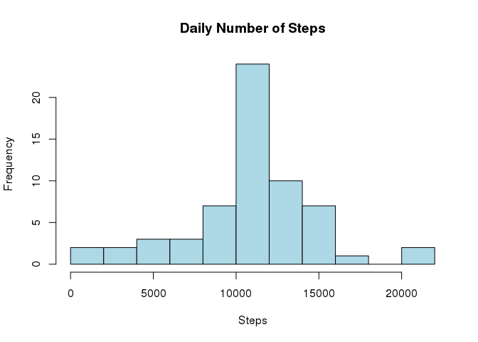

# Personal activity data
Kollanyi  
July 17, 2015  

opts_chunk$set(echo=TRUE, results='asis')

Before you start: Please unzip the activity file and set your working directory according to its location. 

First thing first, load the data.  


```r
activity <- read.csv('activity.csv', sep=",", na.strings = "NA",
                  colClasses =c("numeric", "Date", "numeric"))
```


Load all the librearies:

What is mean total number of steps taken per day?

Make a histogram of the total number of steps taken each day.


```r
ndStep <- tapply(activity$steps, activity$date, function(x) sum(x, na.rm = TRUE))
hist(ndStep, breaks = 15, col="lightblue", main="Daily Number of Steps",  xlab="Steps")
```

 


Calculate the mean and median of the total number of steps taken per day.


```r
ndStepMean <-mean(ndStep, na.rm = TRUE)
ndStepMean
```

```
## [1] 9354.23
```


```r
ndStepsMedian<- median(ndStep,na.rm = TRUE)
ndStepsMedian
```

```
## [1] 10395
```


Make a time series plot (i.e. type = "l") of the 5-minute interval (x-axis) and the average number of steps taken, averaged across all days (y-axis)


```r
library(lattice) 
aggActivity <- aggregate(activity$steps ~ activity$interval, FUN = "mean",  na.rm=T)
names(aggActivity) <- c("interval","avesteps")
xyplot(aggActivity$avesteps ~ aggActivity$interval, type = "l", xlab = "5-mins Intervals", ylab =  "Average # of Steps", main = "Time Series Plot")
```

 

Which 5-minute interval, on average across all the days in the dataset, contains the maximum number of steps?


```r
max <- which.max(aggActivity$avesteps)
```

Calculate and report the total number of missing values in the dataset (i.e. the total number of rows with NAs)


```r
table(is.na(activity$steps))["TRUE"]
```

```
## TRUE 
## 2304
```

Create a new dataset that is equal to the original dataset but with the missing data filled in


```r
library(zoo)
```

```
## 
## Attaching package: 'zoo'
## 
## The following objects are masked from 'package:base':
## 
##     as.Date, as.Date.numeric
```

```r
miss <- na.aggregate(activity$steps)
activity -> activitynomiss
activitynomiss$steps <- miss
```

Make a histogram of the total number of steps taken each day and Calculate and report the mean and median total number of steps taken per day. Do these values differ from the estimates from the first part of the assignment? What is the impact of imputing missing data on the estimates of the total daily number of steps?


```r
missStep <- tapply(activitynomiss$steps, activitynomiss$date, function(x) sum(x, na.rm = TRUE))
hist(missStep, breaks = 15, col="lightblue", main="Daily Number of Steps",  xlab="Steps")
```

 


Calculate the mean and median of the total number of steps taken per day.


```r
missStepMean <-mean(missStep, na.rm = TRUE)
missStepMean
```

```
## [1] 10766.19
```


```r
missStepsMedian<- median(missStep,na.rm = TRUE)
missStepsMedian
```

```
## [1] 10766.19
```

Define a function which separates weekends and weekdays. NOTE: Make sure that the LC_TIME is set to c you can check it with the command sessionInfo()


